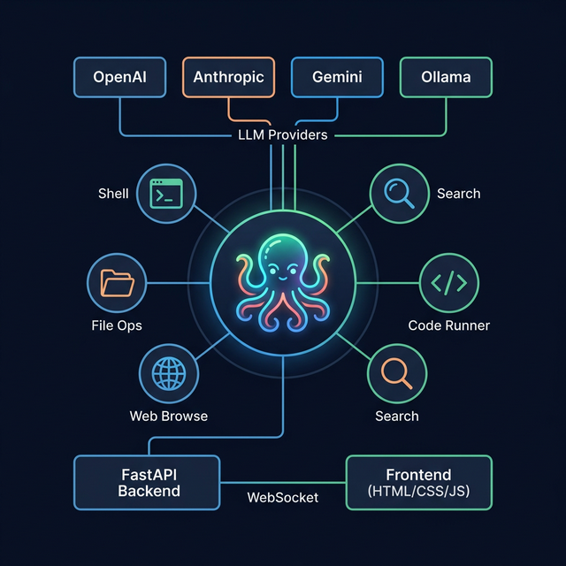
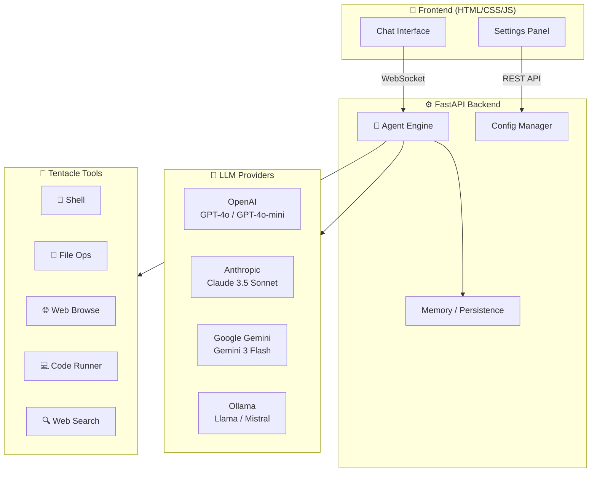
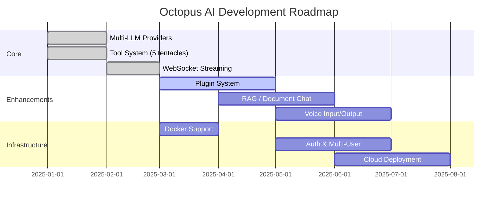

<p align="center">
  
</p>

<p align="center">
  <strong>🐙 Because Two Hands Just Aren't Enough</strong>
</p>

<p align="center">
  <a href="https://github.com/Masriyan/Octopus-Ai/releases"></a>
  <a href="https://github.com/Masriyan/Octopus-Ai/blob/main/LICENSE"></a>
  <a href="https://www.python.org/"></a>
  <a href="https://github.com/Masriyan/Octopus-Ai/stargazers"></a>
  <a href="https://github.com/Masriyan/Octopus-Ai/issues"></a>
</p>

---

## Gemini berkata

### 🐙 Meet Octopus AI: Because Two Hands Just Aren't Enough

Let's be honest: being a human is exhausting. You only have two arms, one brain, and a desperate, daily need for caffeine. How are you supposed to handle a never-ending to-do list with hardware like that?

**Enter Octopus AI.**

### The Philosophy (Why an Octopus?)

We looked at the animal kingdom for the ultimate productivity guru and found the undisputed multitasking ninja of the sea. Why? Because octopuses are freakishly smart and boast eight highly capable arms.

They can open child-proof jars from the inside, solve puzzles, and juggle multiple tasks without breaking a sweat (mostly because they live underwater, but you get the point). We took that big-brained, multi-limbed brilliance and turned it into an AI tool designed to do your heavy lifting.

### What Can the Tentacles Do for You?

🦾 **Eight-Armed Multitasking:** While your clumsy human hands are still typing a single sentence, Octopus AI is already crunching data, drafting emails, organizing your schedule, and virtually high-fiving itself.

🧠 **Escape-Artist Intelligence:** Got a problem that feels like you're stuck in a locked box? Octopus AI uses its massive, squishy digital brain to squeeze through complex problems and find elegant solutions.

🔄 **Total Flexibility:** It adapts to your workflow seamlessly. No rigid bones, no friction—just smooth, intelligent automation wrapping around your daily tasks.

🧹 **100% Mess-Free:** All the genius of a cephalopod, with absolutely zero ink squirted on your nice clean desk when it gets surprised.

> _Stop drowning in a sea of tabs and endless tasks. Let Octopus AI wrap its virtual tentacles around your workload, so you can go back to doing what humans do best: taking naps and drinking coffee._ ☕

---

## 🏗️ Architecture

<p align="center">
  
</p>



---

## 🦑 Features

### 🔧 Five Powerful Tentacles

| Tentacle | Capability          | Description                                               |
| :------: | :------------------ | :-------------------------------------------------------- |
|    🐚    | **Shell Commands**  | Execute system commands with real-time output streaming   |
|    📁    | **File Operations** | Read, write, list, search, and manage files & directories |
|    🌐    | **Web Browse**      | Fetch, parse, and summarize any web page                  |
|    💻    | **Code Execution**  | Run Python code in a sandboxed environment                |
|    🔍    | **Web Search**      | Search the internet via DuckDuckGo                        |

### 🧠 Multi-Provider LLM Support

Switch between AI providers on the fly — no restart needed:

| Provider          | Models                                             | Authentication            |
| :---------------- | :------------------------------------------------- | :------------------------ |
| **OpenAI**        | GPT-4o, GPT-4o-mini, GPT-4-Turbo                   | API Key                   |
| **Anthropic**     | Claude 3.5 Sonnet, Claude 3.5 Haiku, Claude 3 Opus | API Key                   |
| **Google Gemini** | Gemini 3 Flash, Gemini 2.5 Pro/Flash               | API Key or Google Sign-In |
| **Ollama**        | Llama 3.2, Mistral, Code Llama + any local model   | Local (free!)             |

### 🎨 Premium Dark-Ocean GUI

- **Glassmorphism design** with deep-ocean dark theme
- **Animated octopus** welcome screen with CSS tentacle animation
- **Real-time streaming** chat with full Markdown rendering
- **Live tool execution** visualization — see each tentacle in action
- **Settings panel** with provider/model/temperature selection
- **Responsive design** optimized for desktop & mobile
- **Google Sign-In** for seamless Gemini integration

### 💾 Persistent Memory

- Conversations automatically saved to disk as JSON
- Auto-generated conversation titles
- Full-text searchable conversation history
- Configurable context window (up to 50 messages)

---

## 🚀 Installation

### Prerequisites

| Requirement | Version                                                                        |
| :---------- | :----------------------------------------------------------------------------- |
| Python      | 3.10 or higher                                                                 |
| pip         | Latest recommended                                                             |
| API Key     | At least one (OpenAI / Anthropic / Gemini) — _or Ollama for free local models_ |

### Quick Start

```bash
# 1. Clone the repository
git clone https://github.com/Masriyan/Octopus-Ai.git
cd Octopus-Ai

# 2. Make the start script executable
chmod +x start.sh

# 3. Launch everything (auto-installs deps, starts backend + frontend)
./start.sh
```

Then open **http://localhost:5500** in your browser. 🎉

### Manual Setup

If you prefer to set things up manually:

```bash
# Create virtual environment
python3 -m venv venv
source venv/bin/activate

# Install dependencies
pip install -r backend/requirements.txt

# Copy environment config
cp .env.example .env
# Edit .env and add your API key(s)

# Start the backend
cd backend
python3 -m uvicorn main:app --host 0.0.0.0 --port 8000 --reload &

# Start the frontend (in another terminal)
cd frontend
python3 -m http.server 5500
```

### Configure API Keys

1. Open **http://localhost:5500**
2. Click the **⚙️ Settings** button in the sidebar
3. Select your preferred LLM provider
4. Enter your API key and click **Save**
5. Start chatting! 🐙

### Using Ollama (Free / Local)

```bash
# Install Ollama
curl -fsSL https://ollama.ai/install.sh | sh

# Pull a model
ollama pull llama3.2

# In Octopus AI settings → select "Ollama" as provider
```

---

## 📖 Usage

### Basic Chat

Simply type your message and Octopus AI will respond. It automatically detects when tools would be helpful and uses them proactively.

### Capability Quick-Start Cards

The welcome screen features interactive cards that demonstrate each tentacle:

| Card      | Example Prompt                                                       |
| :-------- | :------------------------------------------------------------------- |
| 🐚 Shell  | _"List all files in my home directory"_                              |
| 📁 Files  | _"Read and summarize the README.md in the current project"_          |
| 🔍 Search | _"Search the web for the latest AI news"_                            |
| 💻 Code   | _"Write a Python script to calculate Fibonacci numbers and run it"_  |
| 🌐 Web    | _"Fetch and summarize the contents of https://news.ycombinator.com"_ |
| 🦑 Multi  | _"Help me analyze my system information"_                            |

### Settings & Configuration

| Setting                  | Description                                                 |
| :----------------------- | :---------------------------------------------------------- |
| **LLM Provider**         | Switch between OpenAI, Anthropic, Gemini, or Ollama         |
| **Model**                | Choose the specific model for the selected provider         |
| **Temperature**          | Control response creativity (0.0 = focused, 1.0 = creative) |
| **Tentacle Permissions** | Enable/disable individual tools                             |
| **API Keys**             | Securely save provider API keys                             |
| **Google Sign-In**       | Authenticate with Google for Gemini access                  |

### WebSocket Streaming

Octopus AI uses **WebSocket** connections for real-time, token-by-token streaming — no polling, no delays.

---

## 📁 Project Structure

```
Octopus-Ai/
├── backend/
│   ├── main.py              # FastAPI server + WebSocket endpoints
│   ├── agent.py             # Core agent engine with tool loop
│   ├── llm_providers.py     # OpenAI / Anthropic / Gemini / Ollama
│   ├── config.py            # Configuration manager
│   ├── memory.py            # Conversation persistence (JSON)
│   ├── requirements.txt     # Python dependencies
│   └── tools/
│       ├── __init__.py      # Tool registry & schema builder
│       ├── shell_tool.py    # 🐚 Shell command execution
│       ├── file_tool.py     # 📁 File system operations
│       ├── web_tool.py      # 🌐 HTTP page fetching
│       ├── code_tool.py     # 💻 Python code execution
│       └── search_tool.py   # 🔍 DuckDuckGo web search
├── frontend/
│   ├── index.html           # Main application page
│   ├── css/main.css         # Deep-ocean dark theme
│   └── js/app.js            # Frontend logic & WebSocket client
├── data/                    # Created at runtime (git-ignored)
│   ├── config.json          # User preferences & API keys
│   └── memory/              # Saved conversations
├── docs/
│   └── images/              # Documentation assets
├── .env.example             # Environment variable template
├── .gitignore               # Git ignore rules
├── start.sh                 # One-command launcher
├── CHANGELOG.md             # Release history
├── CONTRIBUTING.md          # Contribution guidelines
├── LICENSE                  # MIT License
└── README.md                # ← You are here
```

---

## 🛠️ Development

### Backend (FastAPI)

```bash
cd backend
python3 -m uvicorn main:app --reload --port 8000
```

### Frontend (Static)

```bash
cd frontend
python3 -m http.server 5500
```

### API Documentation

Visit **http://localhost:8000/docs** for the interactive Swagger UI.

### REST API Endpoints

| Method   | Endpoint                  | Description                     |
| :------- | :------------------------ | :------------------------------ |
| `GET`    | `/api/health`             | Health check                    |
| `GET`    | `/api/config`             | Get configuration (keys masked) |
| `POST`   | `/api/config`             | Update configuration            |
| `POST`   | `/api/config/apikey`      | Save an API key                 |
| `GET`    | `/api/conversations`      | List all conversations          |
| `POST`   | `/api/conversations`      | Create new conversation         |
| `GET`    | `/api/conversations/{id}` | Get conversation with messages  |
| `DELETE` | `/api/conversations/{id}` | Delete conversation             |
| `GET`    | `/api/models/{provider}`  | List available models           |
| `POST`   | `/api/auth/google`        | Google OAuth authentication     |
| `WS`     | `/ws/chat/{conv_id}`      | WebSocket for real-time chat    |

---

## 🗺️ Roadmap



---

## 🤝 Contributing

Contributions are welcome! Please see [CONTRIBUTING.md](CONTRIBUTING.md) for guidelines.

1. Fork the repository
2. Create your feature branch (`git checkout -b feature/amazing-tentacle`)
3. Commit your changes (`git commit -m 'Add amazing tentacle'`)
4. Push to the branch (`git push origin feature/amazing-tentacle`)
5. Open a Pull Request

---

## 📄 License

This project is licensed under the **MIT License** — see the [LICENSE](LICENSE) file for details.

---

## 🐙 Philosophy

> _An octopus has eight arms, each capable of independent action — tasting, gripping, exploring. Octopus AI embodies this: many tools, each specialized, working together to accomplish any task._

---

<p align="center">
  Made with 🐙 by <a href="https://github.com/Masriyan">Masriyan</a>
</p>

<p align="center">
  <a href="https://github.com/Masriyan/Octopus-Ai">⭐ Star this repo</a> •
  <a href="https://github.com/Masriyan/Octopus-Ai/issues">🐛 Report Bug</a> •
  <a href="https://github.com/Masriyan/Octopus-Ai/issues">💡 Request Feature</a>
</p>
