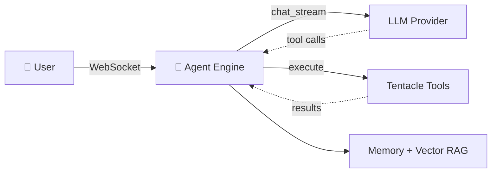

  

# 🐙 Octopus AI — Documentation

Welcome to the full documentation for **Octopus AI v3** — a powerful, multi-model AI agent with many tentacles (tools), a planning/delegation engine, and support for cloud **and** local models.

This `docs/` folder is the single source of truth for **using** and **developing** Octopus AI.

---

## 📚 Table of Contents

### For Users
| Doc | What's inside |
| :-- | :-- |
| [User Guide](user-guide.md) | Install, run, the UI tour, settings, everyday usage, troubleshooting |
| [Providers & Models](providers-and-models.md) | OpenAI · Anthropic · Gemini · Ollama · Local (LM Studio/vLLM), tool modes |
| [Configuration Reference](configuration.md) | Every `config.json` / `.env` key explained |
| [Security & Sandboxing](security.md) | What the agent can/can't do, the workspace jail, threat model |

### For Developers
| Doc | What's inside |
| :-- | :-- |
| [Architecture](architecture.md) | High-level design, request lifecycle, data flow |
| [Code Structure](code-structure.md) | Every file and what it does (backend + frontend) |
| [Agent Engine](agent-engine.md) | The plan → act → observe loop, tool emulation, delegation, memory |
| [Tools Reference](tools-reference.md) | All 8 tentacles + how to add your own |
| [API Reference](api-reference.md) | REST endpoints + WebSocket protocol |
| [Development Guide](development.md) | Dev setup, testing, conventions, adding providers |

---

## ⚡ 60-second overview

- **Frontend** — zero-build vanilla HTML/CSS/JS (`frontend/`), talks to the backend over REST + WebSocket.
- **Backend** — FastAPI (`backend/`): an agent loop that streams tokens, calls tools, and feeds results back to the model.
- **Providers** — OpenAI, Anthropic, Gemini, Ollama, and any OpenAI-compatible local server.
- **Tools (tentacles)** — shell, files, web browse, code, search, image, plan, delegate.

> New here? Start with the **[User Guide](user-guide.md)**. Want to hack on it? Start with **[Architecture](architecture.md)** then **[Code Structure](code-structure.md)**.

---

## 🏷️ Version

This documentation describes **Octopus AI v3.0.0**. See [`../CHANGELOG.md`](../CHANGELOG.md) for the release history.
