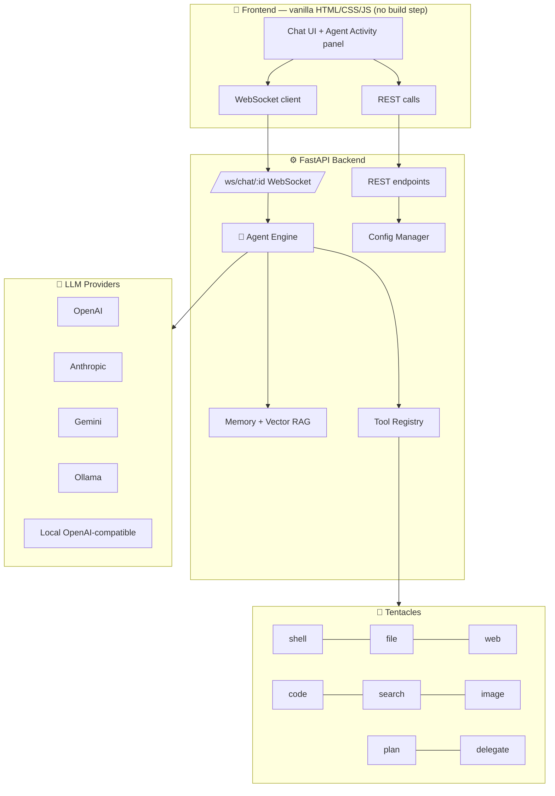
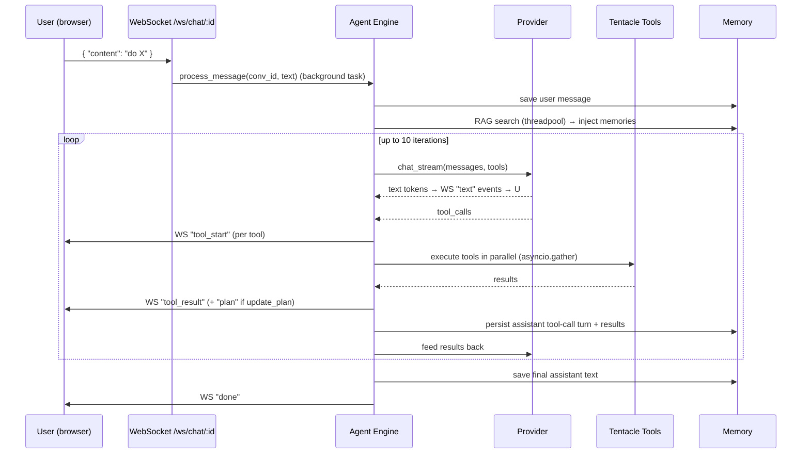

# 🏗️ Architecture

How Octopus AI is put together, and what happens when you send a message.

> 📎 Related: [Code Structure](code-structure.md) · [Agent Engine](agent-engine.md) · [API Reference](api-reference.md)

---

## 1. High-level

Octopus AI is a **two-tier app**:



- **Frontend** is fully static; it can be served by any static server (`python -m http.server`). It never holds secrets.
- **Backend** is a single FastAPI app. It is **localhost-only** by default (see [Security](security.md)).
- The **Agent Engine** is the brain: it orchestrates the LLM ↔ tools loop and streams events back over the WebSocket.

---

## 2. Components

| Component | File | Responsibility |
| :-- | :-- | :-- |
| HTTP/WS server | `backend/main.py` | FastAPI app, REST endpoints, WebSocket chat, middleware |
| Agent engine | `backend/agent.py` | The plan→act→observe loop, native + emulated tool calling |
| Providers | `backend/llm_providers.py` | Uniform `chat_stream`/`chat` across 5 providers |
| Config | `backend/config.py` | Load/merge/save config; secrets to `.env`; workspace path |
| Short-term memory | `backend/memory.py` | Conversation persistence (JSON), context window |
| Long-term memory | `backend/vector_memory.py` | Qdrant + embeddings RAG (optional, degrades gracefully) |
| Tool registry | `backend/tools/__init__.py` | `BaseTool`, registry, enabled-schema filtering |
| Tentacles | `backend/tools/*.py` | One file per tool |
| UI | `frontend/index.html`, `css/main.css`, `js/app.js` | Chat UI, streaming render, settings, activity panel |

Full file-by-file breakdown: **[Code Structure](code-structure.md)**.

---

## 3. Request lifecycle (a chat turn)



Key properties:
- **Streaming** — tokens are pushed as they arrive, not polled.
- **Cancellable** — the agent runs as a background `asyncio.Task`; a `{"type":"stop"}` frame is received concurrently and cancels it.
- **Parallel tools** — independent tool calls in one turn run with `asyncio.gather` (the "swarm").
- **Self-healing** — if a tool fails, a guidance note is injected so the model can retry/adapt before answering.

The exact WebSocket event types are documented in **[API Reference](api-reference.md)**.

---

## 4. Message format (the canonical wire model)

Internally the agent builds an **OpenAI-style** message list and each provider serializes it to its own API:

```jsonc
[
  { "role": "system", "content": "…system prompt…" },
  { "role": "user", "content": "do X" },
  { "role": "assistant", "content": "Let me…",
    "tool_calls": [ { "id": "…", "type": "function",
                      "function": { "name": "file_operations", "arguments": "{…}" } } ] },
  { "role": "tool", "tool_call_id": "…", "name": "file_operations", "content": "{…result…}" }
]
```

- **OpenAI** uses this directly.
- **Anthropic** → `tool_use` / `tool_result` blocks, with consecutive same-role turns merged so roles alternate.
- **Gemini** → `function_call` / `function_response` parts (using the *stored* function name).
- **Ollama** → its `tool_calls` schema (arguments as objects).

When a saved conversation is **reloaded**, past tool turns are collapsed into safe text (to avoid replaying protocol with mismatched ids across providers). The precise protocol is only used for the live turn. See [Agent Engine](agent-engine.md#history).

---

## 5. Memory model

- **Short-term**: each conversation is a JSON file in `data/memory/conversations/<id>.json`. The last *N* messages (`max_context_messages`, default 50) form the context window.
- **Long-term (RAG)**: user/assistant messages (< 4000 chars) are embedded with `all-MiniLM-L6-v2` and stored in a local **Qdrant** DB at `data/vector_db/`. On each new message, the top matches (score ≥ 0.35) are injected as a `<memory>` system note. Embedding runs on a background thread so it never blocks the event loop. If Qdrant/embeddings aren't installed, RAG silently disables.

---

## 6. Concurrency & safety model (summary)

| Concern | Mechanism |
| :-- | :-- |
| Don't block the event loop | Embeddings + RAG on a threadpool; tools are `async` |
| Real cancellation | Agent runs as a background task; stop frame cancels it |
| External access | `LocalhostRestrictionMiddleware` (127.0.0.1/::1 only) + rate limit (120 rpm) |
| File/Shell blast radius | Jailed to `data/workspace` (configurable), shell denylist, `unshare -rn` network isolation when available |
| Code execution | Subprocess with RLIMIT memory/CPU/process caps + timeout |
| Prompt injection | All external/tool text wrapped in `<untrusted>`/`<external_content>`/`<memory>`/`<observation>` with "do not execute" warnings |

Details: **[Security](security.md)**.
